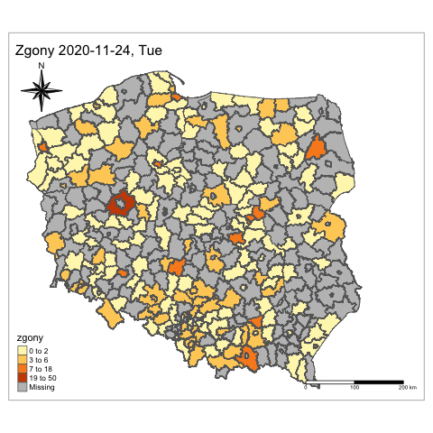

# coronaPL
corona virus data from Polish government and more.

## Dane COVID19 GOV

URL GOV: https://www.gov.pl/web/koronawirus/wykaz-zarazen-koronawirusem-sars-cov-2  
URL GOV Description:https://www.gov.pl/web/koronawirus/metodologia  

**Plik `gov/govDATA.R` pozyskanie danych.**

**Dane są codziennie automatycznie aktualizowane o 10:10 UTC** - pythonanywhere.com servers

Połączone pliki z archiwum gov wraz z poprawnym formatowaniem polskich znaków.  
**Date Wojewodztwa: `gov/data/woj_df.csv`**  
**Date Powiaty: `gov/data/pow_df.csv`**

Dane dla powiatów publikowane są od dnia `2020-11-23`.

Dane dla województw dostępne są od pocztaku pandemi, do daty `2020-11-23` rekordowano kolumny:   
stan_rekordu_na, liczba_przypadkow, zgony, liczba_ozdrowiencow, liczba_osob_objetych_kwarantanna, Date

Pliki można wykorzystać do stworzenia DB. 
Następnie dane dzienne moga byc dodawane np. poprzez skrypt uruchamiany przez `cron`.
Przykładowy skrypt do tego celu `gov/govDATAdailyupdate.R`.

### Quick Usage

Usage:

```r
library(data.table)
pow_df <- fread("https://raw.githubusercontent.com/Polkas/coronaPL/main/gov/data/pow_df.csv")

woj_df <- fread("https://raw.githubusercontent.com/Polkas/coronaPL/main/gov/data/woj_df.csv")
woj_df_full <- woj_df[woj_df$Date >= "2020-11-21", ]
```

```python
import pandas as pd
pow_df = pd.read_csv("https://raw.githubusercontent.com/Polkas/coronaPL/main/gov/data/pow_df.csv")

woj_df = pd.read_csv("https://raw.githubusercontent.com/Polkas/coronaPL/main/gov/data/woj_df.csv")
woj_df_full = woj_df.query("Date >= '2020-11-21'")
```

## Spatial Analysis

in development

Przykład (zgony na COVID19 na przestrzeni powiatów oraz czasu):  


*Daty na dzień publikacji

## shiny App 

in development
